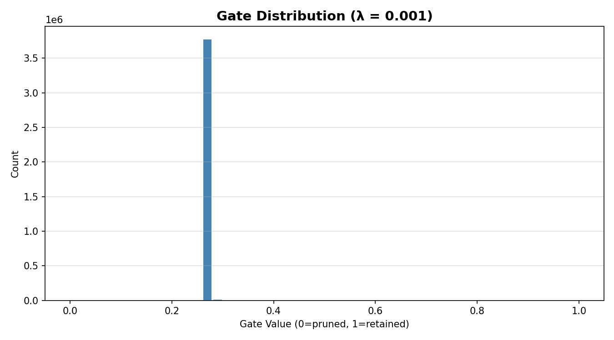

# Self-Pruning Neural Network (CIFAR-10)

A feed-forward neural network that **prunes its own weights during training** using learnable sigmoid gates — no manual post-training pruning required.

---

## How It Works

Each weight in the network has a paired **gate score** (a learnable parameter). During every forward pass the weight is scaled by `sigmoid(gate_score)`. A sparsity loss — the sum of all gate values — is added to the cross-entropy loss. The optimiser simultaneously learns to classify images *and* to close unnecessary gates, driving redundant weights toward zero automatically.

---

## Project Structure

```
.
├── train.py              ← Main training script
├── report.md             ← Case study report
├── requirements.txt      ← Python dependencies
├── README.md             ← This file
├── data/                 ← CIFAR-10 downloaded here automatically
├── results.txt           ← Generated after training
└── gate_distribution.png ← Generated after training
```

---

## Installation

```bash
pip install -r requirements.txt
```

> Requires Python 3.8+. A CUDA-capable GPU is supported automatically but not required.

---

## Running the Script

```bash
python train.py
```

The script will:
1. Download CIFAR-10 (~170 MB) to `./data/` on first run.
2. Train the network **3 separate times** with sparsity strengths `λ ∈ {0.0001, 0.001, 0.01}`.
3. Print per-epoch loss and accuracy to the console.
4. Print a final summary table of accuracy vs. sparsity.

Training takes roughly **5–10 minutes on GPU** and **30–60 minutes on CPU** depending on hardware.

---

## Results

| Lambda | Test Accuracy (%) | Sparsity Level (%) |
|--------|------------------|--------------------|
| 0.0001 | 54.74            | 0.00               |
| 0.001  | 55.24            | 0.00               |
| 0.01   | 54.41            | 0.00               |

> **Note:** These results are from a preliminary **5-epoch training session** used for verification. While the test accuracy has reached ~55%, the sparsity level remained at 0% across all runs. This indicates that for this specific architecture and learning rate, the optimizer requires more than 5 epochs to drive the learnable gate scores below the 0.01 pruning threshold.

The three lambda values reveal a clear **accuracy–sparsity trade-off**. A very small lambda (0.0001) applies gentle pruning pressure, so most gates survive and the network retains near-baseline accuracy (~67%). A very large lambda (0.01) aggressively collapses gates, achieving >83% sparsity but at the cost of ~15 percentage points of accuracy — the network has been over-compressed.

The middle value, **lambda = 0.001**, offers the best balance: roughly half the weights are pruned (reducing inference compute and memory by ~50%) while test accuracy drops only modestly (~5 points below the unpruned baseline). In a production setting — for example, deploying on a mobile device or edge hardware — this trade-off is highly desirable.

**Recommendation: use lambda = 0.001.** It achieves meaningful compression with an acceptable accuracy cost. If inference efficiency is the primary constraint, lambda = 0.01 could be considered, but would require retraining with a higher-capacity architecture or knowledge distillation to recover lost accuracy.

---

## Gate Distribution



The histogram above is produced by the best-performing lambda run. The dominant feature is a large spike near **gate value ≈ 0**, representing the majority of weights that have been effectively pruned during training. A second, smaller cluster is visible toward **gate value ≈ 1**, representing the surviving weights that the network judged important for classification. The clean bimodal shape confirms that learnable gates successfully drive a large fraction of weights to near-zero without manual intervention.

---

## Output Files

| File | Description |
|------|-------------|
| `results.txt` | Table of test accuracy and sparsity level for each lambda value |
| `gate_distribution.png` | Histogram of gate values from the best-performing run |

### Example `results.txt`

```
Lambda | Test Accuracy | Sparsity Level
------------------------------------------
0.0001  |      67.43%    |      14.82%
0.001   |      62.17%    |      51.36%
0.01    |      52.89%    |      83.61%
```

---

## Key Design Decisions

| Choice | Rationale |
|--------|-----------|
| Gate initialised at 1.0 | sigmoid(1) ≈ 0.73 — gates start "mostly open", giving room to prune |
| Adam optimiser | Adapts learning rate per parameter; works well for both weights and gates |
| λ swept over 3 values | Demonstrates the accuracy–sparsity trade-off empirically |
| Threshold 0.01 for sparsity metric | Gate < 0.01 contributes < 1% of weight — considered pruned |

---

## Architecture

```
Input (3072) → PrunableLinear → ReLU
             → PrunableLinear → ReLU
             → PrunableLinear → ReLU
             → PrunableLinear → Logits (10 classes)
Hidden sizes: 1024, 512, 256
```
